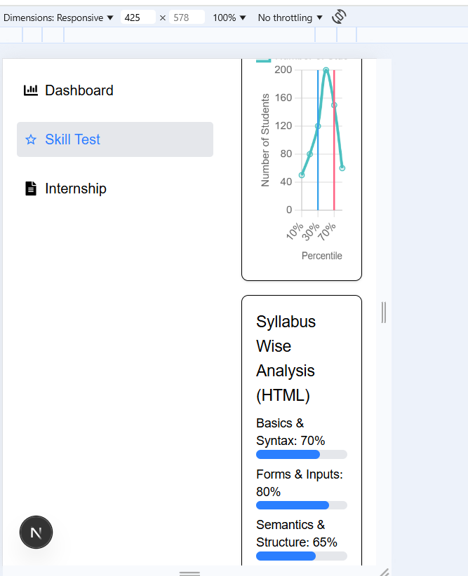

This is a [Next.js](https://nextjs.org) project bootstrapped with [`create-next-app`](https://github.com/vercel/next.js/tree/canary/packages/create-next-app).

## Getting Started

First, run the development server:

```bash
npm run dev
# or
yarn dev
# or
pnpm dev
# or
bun dev
```

Open [http://localhost:3000](http://localhost:3000) with your browser to see the result.

You can start editing the page by modifying `app/page.js`. The page auto-updates as you edit the file.

This project uses [`next/font`](https://nextjs.org/docs/app/building-your-application/optimizing/fonts) to automatically optimize and load [Geist](https://vercel.com/font), a new font family for Vercel.

## Learn More

To learn more about Next.js, take a look at the following resources:

- [Next.js Documentation](https://nextjs.org/docs) - learn about Next.js features and API.
- [Learn Next.js](https://nextjs.org/learn) - an interactive Next.js tutorial.

You can check out [the Next.js GitHub repository](https://github.com/vercel/next.js) - your feedback and contributions are welcome!

## Deploy on Vercel

The easiest way to deploy your Next.js app is to use the [Vercel Platform](https://vercel.com/new?utm_medium=default-template&filter=next.js&utm_source=create-next-app&utm_campaign=create-next-app-readme) from the creators of Next.js.

Check out our [Next.js deployment documentation](https://nextjs.org/docs/app/building-your-application/deploying) for more details.


# Next.js-skill-test-analytics-dashboard
Skill Test Analytics Dashboard is a responsive web application built with Next.js, Tailwind CSS, and Chart.js, designed to help candidates analyze skill test performance (e.g., HTML, JavaScript) through interactive charts and statistics. Users log in to view test results, update scores, and compare performance.

## Features
- **User Authentication**: Secure login to access personalized test results.
- **Skill Overview**: Displays skill test details (e.g., questions, duration, submitted date) with an option to update scores.
- **Quick Statistics**: Shows rank, percentile, and correct answers with icons in a responsive layout.
- **Comparison Graph**: Visualizes percentile distribution using a line graph with annotations.
- **Syllabus Analysis**: Presents syllabus-wise performance with progress bars.
- **Question Analysis**: Displays correct answers as a circular progress indicator.
- **Responsive Design**: Fully responsive across all screen sizes, from mobile to desktop.

## Tech Stack
- **Framework**: Next.js (React framework for server-side rendering and static site generation)
- **Styling**: Tailwind CSS (utility-first CSS framework)
- **Charts**: Chart.js with `react-chartjs-2` (for interactive line graphs)
- **State Management**: React Context API (for managing skill data)
- **Icons**: Custom icons stored in the `public` folder
- **Deployment**: Vercel (recommended for Next.js apps) 

## Setup Instructions
1. **Clone the Repository**:
   ```bash
   git clone https://github.com/Runnu-Kumari28/Next.js-skill-test-analytics-dashboard.git
   cd next-js-skill-test-analytics-dashboard
   cd skill-analytics-dashboard 

2. **Install Dependencies**:
    ```bash
    npm install

3. **Run the Development Server**:
    ```bash
    npm run dev
Open http://localhost:3000 in your browser.

4. **Build for Production**:
    ```bash
    npm run build
    npm run start 

## Usage
- View Results: Navigate to the SkillTest page to see your test performance.

- Analyze Performance: Check your rank, percentile, and correct answers in Quick Statistics.

- Compare your percentile with others in the Comparison Graph.

- Review syllabus-wise performance in Syllabus Analysis.

- See correct answers in Question Analysis.

- Update Scores: Use the "Update" button in Skill Overview to modify your rank, percentile, and correct answers.

## Screenshots of the project development process: 
1. Header: 
 

2. Sidebar: 
 

3. Skill-test-page: 
 


4. Responsive: 





